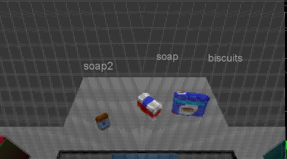

## Project: Perception Pick & Place

# Required Steps for a Passing Submission:
1. Extract features and train an SVM model on new objects (see `pick_list_*.yaml` in `/pr2_robot/config/` for the list of models you'll be trying to identify). 
2. Write a ROS node and subscribe to `/pr2/world/points` topic. This topic contains noisy point cloud data that you must work with.
3. Use filtering and RANSAC plane fitting to isolate the objects of interest from the rest of the scene.
4. Apply Euclidean clustering to create separate clusters for individual items.
5. Perform object recognition on these objects and assign them labels (markers in RViz).
6. Calculate the centroid (average in x, y and z) of the set of points belonging to that each object.
7. Create ROS messages containing the details of each object (name, pick_pose, etc.) and write these messages out to `.yaml` files, one for each of the 3 scenarios (`test1-3.world` in `/pr2_robot/worlds/`).  [See the example `output.yaml` for details on what the output should look like.](https://github.com/udacity/RoboND-Perception-Project/blob/master/pr2_robot/config/output.yaml)  
8. Submit a link to your GitHub repo for the project or the Python code for your perception pipeline and your output `.yaml` files (3 `.yaml` files, one for each test world).  You must have correctly identified 100% of objects from `pick_list_1.yaml` for `test1.world`, 80% of items from `pick_list_2.yaml` for `test2.world` and 75% of items from `pick_list_3.yaml` in `test3.world`.

## [Rubric](https://review.udacity.com/#!/rubrics/1067/view) Points
### Here I will consider the rubric points individually and describe how I addressed each point in my implementation.  

---
### Writeup / README

#### 1. Provide a Writeup / README that includes all the rubric points and how you addressed each one.  You can submit your writeup as markdown or pdf.  

You're reading it!

### Exercise 1, 2 and 3 pipeline implemented
#### 1. Complete Exercise 1 steps. Pipeline for filtering and RANSAC plane fitting implemented.
For this project I used the script [project_template3.py](./pr2_robot/scripts/project_template3.py). To load the evironment, the following terminal command was executed:
```python
roslaunch pr2_robot pick_place_project.launch
```

In a second window, the object recognition was loaded using this command:
```python
rosrun pr2_robot project_template3.py
```

I started the code by changing the ros message into a point cloud. To deal with the noise, I implemented a statistical outlier filter. I considered the 20 points around each point and set the scale factor to 0.6. This filter helped to remove most of the noise in the signal.
```python
# Callback function for your Point Cloud Subscriber
def pcl_callback(pcl_msg):

# Exercise-2 TODOs:

    # DONE: Convert ROS msg to PCL data
    plc_cloud =  ros_to_pcl(pcl_msg)

    # DONE: Statistical Outlier Filtering
    # Much like the previous filters, we start by creating a filter object: 
    outlier_filter = plc_cloud.make_statistical_outlier_filter()
    
    # Set the number of neighboring points to analyze for any given point
    outlier_filter.set_mean_k(20)
    
    # Set threshold scale factor
    x = .6
    
    # Any point with a mean distance larger than global (mean distance+x*std_dev) will be considered outlier
    outlier_filter.set_std_dev_mul_thresh(x)
    
    # Finally call the filter function for magic
    outlier_filtered = outlier_filter.filter()    
```

Next, I down sampled by cloud to make it easier to work with. Initially I had ok results with a 0.01 leaf size. However, I had trouble identifying the book and glue. To address that issue I chose to make my leaf size smaller, allowing a richer cloud to be processed. After halving the number twice, I was able to identify the book. It should be noted that for other environments, the leaf size that I used is excessive, but I wanted to be able to use one script for all three environments.

```python
    # DONE: Voxel Grid Downsampling
    # Choose a voxel (also known as leaf) size
    # LOWER NUMBER = HIGH DENSITY
    LEAF_SIZE = .0025

    # Create a VoxelGrid filter object for our input point cloud
    vox = outlier_filtered.make_voxel_grid_filter()    
    
    # Set the voxel (or leaf) size 
    vox.set_leaf_size(LEAF_SIZE, LEAF_SIZE, LEAF_SIZE)
    
    # Call the filter function to obtain the resultant downsampled point cloud
    vox_filtered = vox.filter()
```

After downsampling, I needed to filter out the area that the objects appeared in. I did this using a pass through filter. The first was a Z axis filter similar to what was used in the exercises. I did need to increase the upper limit, to avoid cutting off the tops of taller objects. After filtering the cloud, published a ros msg with the results. By visualizing this cloud, I saw that the edges of the bins were seen by the robot. This meant that during clustering I would see 2 extra objects. I added a second filter in the y axis to eliminate the bins. 

```python
    # DONE: PassThrough Filter
    # Create a PassThrough filter object.
    passthrough = vox_filtered.make_passthrough_filter()
    
    # Assign axis and range to the passthrough filter object.
    filter_axis = 'z'
    passthrough.set_filter_field_name(filter_axis)
    axis_min = 0.6
    axis_max = 1.25
    passthrough.set_filter_limits(axis_min, axis_max)

    # Apply passthrough filter
    cloud_passed = passthrough.filter()
    
    # also filiter in y axis to get rid of bin corners
    cloud_passed_z = cloud_passed.make_passthrough_filter()
    
    # Assign axis and range to the passthrough filter object.
    filter_axis = 'y'
    cloud_passed_z.set_filter_field_name(filter_axis)
    axis_min = -0.4 
    axis_max = 0.4
    cloud_passed_z.set_filter_limits(axis_min, axis_max)

    # Apply passthrough filter
    cloud_passed = cloud_passed_z.filter()
    
    cloud_passed_4msg = copy.deepcopy(cloud_passed)
```
Filtered Cloud:


Now I needed to remove the table using a RANSAC plane. I implemented the version of this that I used in exercise 1. After I found the plane. I grabbed the indexes of the inliers(table) and outliers(objects). I also created clouds of these objects that were later published.

```python
    # DONE: RANSAC Plane Segmentation
    seg = cloud_passed.make_segmenter()

    # Set the model you wish to fit 
    seg.set_model_type(pcl.SACMODEL_PLANE)
    seg.set_method_type(pcl.SAC_RANSAC)
    
    # Max distance for a point to be considered fitting the model
    # Experiment with different values for max_distance 
    # for segmenting the table
    max_distance = 0.01
    seg.set_distance_threshold(max_distance)
    
    # DONE: Extract inliers and outliers
    # Call the segment function to obtain set of inlier indices and model coefficients
    inliers, coefficients = seg.segment()
    
    # Extract inliers and outliers
    # At this point the clouds are different
    cloud_objects = cloud_passed.extract(inliers, negative=True)
    cloud_table = cloud_passed.extract(inliers, negative=False)
```
Table Cloud:


Objects Cloud:


#### 2. Complete Exercise 2 steps: Pipeline including clustering for segmentation implemented.  
Now that the cloud containing all of the objects was found, I needed to segment them. To do this I applied Euclidean clustering. This clustering was prefered because you don't need to know how many clusters there are ahead of time. It took some trial and error to determine the min and max cluster sizes. These numbers also needed to be revise when the leaf size changed. Eventually I settle on a tolerance of 0.2, with cluster ranging from 500 to 7000 points. This allowed me to capture the correct number of objects in all scenes. After finding all of the objects, I looped through to build an array of clouds that represent each found cluster with a unique color. I published this cloud and the others at this step as well.

```python
    # DONE: Euclidean Clustering
    # Define max_distance (eps parameter in DBSCAN())
    white_cloud = XYZRGB_to_XYZ(cloud_objects)
    tree = white_cloud.make_kdtree()
    
    # Create a cluster extraction object
    ec = white_cloud.make_EuclideanClusterExtraction()
    # Set tolerances for distance threshold 
    # as well as minimum and maximum cluster size (in points)
    # NOTE: These are poor choices of clustering parameters
    # Your task is to experiment and find values that work for segmenting objects.
    ec.set_ClusterTolerance(0.02)
    ec.set_MinClusterSize(500)
    ec.set_MaxClusterSize(7000)
    # Search the k-d tree for clusters
    ec.set_SearchMethod(tree)
    # Extract indices for each of the discovered clusters
    cluster_indices = ec.Extract()

    # DONE: Create Cluster-Mask Point Cloud to visualize each cluster separately
    #Assign a color corresponding to each segmented object in scene
    cluster_color = get_color_list(len(cluster_indices))
    
    # container for the colored clouds
    color_cluster_point_list = []
    
    for j, indices in enumerate(cluster_indices):
        
        for i, indice in enumerate(indices):
            color_cluster_point_list.append([white_cloud[indice][0],
                                            white_cloud[indice][1],
                                            white_cloud[indice][2],
                                            rgb_to_float(cluster_color[j])])
    
    #Create new cloud containing all clusters, each with unique color
    cluster_cloud = pcl.PointCloud_PointXYZRGB()
    cluster_cloud.from_list(color_cluster_point_list)
    

    # DONE: Convert PCL data to ROS messages
    # Convert PCL data to ROS messages
    ros_passed_cloud = pcl_to_ros(cloud_passed_4msg)
    ros_cloud_objects =  pcl_to_ros(cloud_objects)
    ros_cloud_table = pcl_to_ros(cloud_table)
    ros_cluster_cloud = pcl_to_ros(cluster_cloud)
    

    # DONE: Publish ROS messages
    # Publish ROS messages
    pcl_passed_pub.publish(ros_passed_cloud)
    pcl_objects_pub.publish(ros_cloud_objects)
    pcl_table_pub.publish(ros_cloud_table)
    pcl_cluster_pub.publish(ros_cluster_cloud)
```

Cluster Cloud:


#### 2. Complete Exercise 3 Steps.  Features extracted and SVM trained.  Object recognition implemented.
Now that the objects were found, I needed to classify them. To do this I needed to first get the features of the objects and train a SVM. To obtain the object features, I used the sensor_stick model. I copied the script that was used to get the features in exercise 3 and modified it. I called the new script [capture_features_pr2_100.py](./pr2_robot/scripts/capture_features_pr2_100.py) because I was originally going to capture 100 clouds per image. I later revised that to 60. I also modified the compute_color_histograms and compute_normal_histograms from the [features.py](./supporting_scripts/features.py) script. I added the ability to input the number of bins in the function to make the scripts more versatile. After some trial and error, I ended up using 85 bins, that allowed for 3 full values of colors per bin (255/3 = 85). The capture_features_pr2_100 would take the histograms of colors and normals and save them to a file for training the SVM later. I went through several iterations in order to get a set that gave me accurate results. I tried to balance the number of bins to give enough separation, but to not be too broad that features were unrecognizable. The capture_features_pr2_100 script was run after the training model was launched. In one terminal I executed the following command:

```python
roslaunch sensor_stick training.launch
```

Then in a second terminal I execute this command to capture the features:
```python
rosrun pr2_robot capture_features_pr2_100.py
```

This output the training set file [pr2_traing_set_60_3bins.sav](./pr2_robot/scripts/pr2_traing_set_60_3bins.sav)

After getting the initial file, I needed to train it. I used a training file that I developed for exercise 3, modifying it slightly. I used a linear kernel and was able to achieve good results after setting the histogram bins to 85. My training file was [train_svm_pr2.py](./pr2_robot/scripts/train_svm_pr2.py) .  I trained my SVM using the following command:
```python
rosrun pr2_robot train_svm_pr2.py 
```

The confusion matrices can be seen below. They show that the linear kernel does a good job at identifying the objects.


The model was stored in [pr2_model_60_85bins.sav](./pr2_robot/scripts/pr2_model_60_85bins.sav).

Now that the SVM had trained a model, the [project_template3.py](./pr2_robot/scripts/project_template3.py) file needed to make use of it. The model was imported in __name__ , where the other setup takes place.

```python
if __name__ == '__main__':

    # DONE: ROS node initialization
    rospy.init_node('clustering', anonymous=True)
    
    # DONE: Create Subscribers
    pcl_sub = rospy.Subscriber("/pr2/world/points", pc2.PointCloud2, pcl_callback, queue_size=1)

    # DONE: Create Publishers

    pcl_passed_pub = rospy.Publisher("/pcl_passsed", PointCloud2, queue_size=1)
    pcl_objects_pub = rospy.Publisher("/pcl_objects", PointCloud2, queue_size=1)
    pcl_table_pub = rospy.Publisher("/pcl_table", PointCloud2, queue_size=1)
    pcl_cluster_pub = rospy.Publisher("/pcl_cluster", PointCloud2, queue_size=1)
    
#    #For each object    
#    pcl_obj0_pub = rospy.Publisher("/pcl_object0", PointCloud2, queue_size=1)
#    pcl_obj1_pub = rospy.Publisher("/pcl_object1", PointCloud2, queue_size=1)
#    pcl_obj2_pub = rospy.Publisher("/pcl_object2", PointCloud2, queue_size=1)
#    pcl_obj3_pub = rospy.Publisher("/pcl_object3", PointCloud2, queue_size=1)
#    pcl_obj4_pub = rospy.Publisher("/pcl_object4", PointCloud2, queue_size=1)
#    pcl_obj5_pub = rospy.Publisher("/pcl_object5", PointCloud2, queue_size=1)
#    pcl_obj6_pub = rospy.Publisher("/pcl_object6", PointCloud2, queue_size=1)
#    pcl_obj7_pub = rospy.Publisher("/pcl_object7", PointCloud2, queue_size=1)
    
    object_markers_pub = rospy.Publisher("/object_markers", Marker, queue_size=1)
    detected_objects_pub = rospy.Publisher("/detected_objects", DetectedObjectsArray, queue_size=1)

    # DONE: Load Model From disk
#    model = pickle.load(open(os.path.expanduser('~/catkin_ws/src/RoboND-Perception-Project/pr2_robot/scripts/pr2_model_100.sav'), 'rb'))
#    model = pickle.load(open(os.path.expanduser('~/catkin_ws/src/RoboND-Perception-Project/pr2_robot/scripts/pr2_model_orient.sav'), 'rb'))
    model = pickle.load(open(os.path.expanduser('~/catkin_ws/src/RoboND-Perception-Project/pr2_robot/scripts/pr2_model_60_85bins.sav'), 'rb'))
    
    clf = model['classifier']
    encoder = LabelEncoder()
    encoder.classes_ = model['classes']
    scaler = model['scaler']

    # Initialize color_list
    get_color_list.color_list = []

    # DONE: Spin while node is not shutdown
    while not rospy.is_shutdown():
        rospy.spin()
```

Now I needed to identify what each of my detected objects were. I started by looping through each cluster and building a point cloud for this known, good object. Then I turned that point cloud into a ros message and appended to a group detected_objects_clouds. For initial troubleshooting, I would publish each object to see what the cloud looked like. This helped me to find a major error using the enumerator function early on.

```python
# Exercise-3 TODOs:
    detected_objects_labels = []
    detected_objects = []
    detected_objects_clouds =[]
    
    # Classify the clusters! (loop through each detected cluster one at a time)

    for obj_num, cloud_indices in enumerate(cluster_indices):
        obj_temp =[]    
        for ind, pnt in enumerate(cluster_indices[obj_num]):
            
            obj_temp.append([cloud_objects[pnt][0],
                           cloud_objects[pnt][1],
                           cloud_objects[pnt][2],
                           cloud_objects[pnt][3]])
        
        good_object_cluster = pcl.PointCloud_PointXYZRGB()
        good_object_cluster.from_list(obj_temp)
                    
    # DONE: convert the cluster from pcl to ROS using helper function
        ros_good_object_cluster = pcl_to_ros(good_object_cluster)
        detected_objects_clouds.append(ros_good_object_cluster)
```

The ros message then had its features extracted. These features were fed into the prediction model to get a label assigned to them. The label was setup to be published to RViz to provide a graphic of identification. Next the label and cloud were used to create a detected object and appended to the detected_objects list.

```python
        # Extract histogram features
        # DONE: complete this step just as is covered in capture_features.py
        chists = compute_color_histograms(ros_good_object_cluster, using_hsv=True, nbins=85)
        normals = get_normals(ros_good_object_cluster)
        nhists = compute_normal_histograms(normals, nbins=85)
        feature = np.concatenate((chists, nhists))
    
    
        # Make the prediction, retrieve the label for the result
        # and add it to detected_objects_labels list
        prediction = clf.predict(scaler.transform(feature.reshape(1,-1)))
        label = encoder.inverse_transform(prediction)[0]
        detected_objects_labels.append(label)
    
        # Publish a label into RViz
        label_pos = list(white_cloud[cloud_indices[0]])
        label_pos[2] += .4
        object_markers_pub.publish(make_label(label,label_pos, ind))
        
        # Add the detected object to the list of detected objects.
        do = DetectedObject()
        do.label = label
        do.cloud = ros_good_object_cluster
        detected_objects.append(do)
```

The detected object labels were printed to the terminal and the detected objects list was published and then passed to the pr2_mover function.
```python
    rospy.loginfo('Detected {} objects: {}'.format(len(detected_objects_labels), detected_objects_labels))
    print('')
    

    # Publish the list of detected objects
    # This is the output you'll need to complete the upcoming project!
    detected_objects_pub.publish(detected_objects)

    # Suggested location for where to invoke your pr2_mover() function within pcl_callback()
    # Could add some logic to determine whether or not your object detections are robust
    # before calling pr2_mover()
    try:
        pr2_mover(detected_objects)
    except rospy.ROSInterruptException:
        pass
```

The model that I created was able to do a good job at identifying objects. While it initially struggled with the book, I was able to adjust the downsampling to achieve a model that passed all 3 worlds.

##### World 1


##### World 2


##### World 3


### Pick and Place Setup

#### 1. For all three tabletop setups (`test*.world`), perform object recognition, then read in respective pick list (`pick_list_*.yaml`). Next construct the messages that would comprise a valid `PickPlace` request output them to `.yaml` format.

For the pick and place set up, I first needed to establish the initialize the variables that I would be working with. I also assigned the TEST_SCENE_NUM, manually during this step. Next, I needed to get the pick list and dropbox messages. I created dictionaries from the messages. I chose to go through the dropbox list first. This way I had a dictionary that used the group (red or green) as a key and would return the arm name and drop off position. Next I went through the pick list and used the object name as the key. Instead of having it return the group, I put the group entry into the dropbox dictionary. That way that the item name would now return the arm name, group, and drop off position. This allowed for less substitution later in the code. I also created 2 variables to track the number of items dropped in each bin. The script then printed out text telling how many items from the pick list would be looped through.

```python
    # DONE: Initialize variables
    TEST_SCENE_NUM = Int32()
    OBJECT_NAME = String()
    WHICH_ARM = String()
    PICK_POSE = Pose()
    PLACE_POSE = Pose()
    
    TEST_SCENE_NUM.data = 3
    
    output_list = []
    
    # Make the dictionaries
    object_param_dict = {}
    dropbox_param_dict = {}    

    # DONE: Get/Read parameters
    # get parameters
    object_list_param = rospy.get_param('/object_list')
    dropbox_param_list = rospy.get_param('/dropbox')
    
    # DONE: Parse parameters into individual variables
    # cycle through drop box params with key [group] mapping to arm name, group 
    # and position
    for i in range(0, len(dropbox_param_list)):
        dropbox_param_dict[dropbox_param_list[i]['group']] = dropbox_param_list[i]
    
    # make dictionary for objects
    for i in range(0, len(object_list_param)):
        # Make dict object_param where key [name] maps to the [group] 
        # properties of arm name, group and position
        object_param_dict[object_list_param[i]['name']] = dropbox_param_dict[object_list_param[i]['group']]        
    
    # TODO: Rotate PR2 in place to capture side tables for the collision map (BONUS)
    
    r_drops = 0
    l_drops = 0
        
    print('Looping through '+str(len(object_list_param))+' objects')
    print('') 
```

Next, I created a loop to go through the pick list. The first action of the loop was to print which object is being searched for. Then a flag is set indicating that the object hasn't be found yet. A sub-loop that goes through all of the detected items tries to find the item from the list. If the object is not found, a message to that effect is printed and the next item from the pick list is searched for. 

If the object is found, a message is printed telling the user that it has been found. The OBJECT_NAME is assigned, and WHICH_ARM is determined using the dictionary object_param_dict. The object's centroid is then found and assigned to the PICK_POSE. To introduce some variation for the drop off, I would modify the y position of the bin by 0.06 and the x by 0.2. I used the number if items returned to each bin to ensure unique placement of up to 6 items per bin. They would either be left or right by 0.06 and either 0.2 froward, 0.2 backward, or on center front to back. These modifications were applied to the dictionary output for position and saved to PLACE_POSE. With all of the components assigned, a yaml dictionary was created using the provided function. This dictionary was then added to the list of dictionaries called output_list. A message was then sent to the pick_place routine to have the arm pick up the objects.

```python
    # DONE: Loop through the pick list
    for object_to_pick in object_param_dict.keys():
        print('Looking for '+object_to_pick)
        
        # set flag to know that object was found        
        obj_found = False        
        
        # Cycle through the detected objects to find the one that is needed
        for idx, detected in enumerate(object_list):
            
            # See if this is the one                                  
            if detected.label == object_to_pick:
                obj_found = True
                break
        
        # decide what to do (found vs not found)
        if  obj_found:
            print(object_to_pick+' was found')
            
            # Grab name for 'pick_place_routine' service
            OBJECT_NAME.data = object_to_pick            
            
            # DONE: Assign the arm to be used for pick_place
            WHICH_ARM.data = object_param_dict[object_to_pick]['name']
            
            # DONE: Get the PointCloud for a given object and obtain its centroid
            obj_pnt_cloud_array = ros_to_pcl(detected.cloud).to_array()
            centroid = np.mean(obj_pnt_cloud_array, axis=0)[:3]
             
            # Give the pick pose
            PICK_POSE.position.x = np.asscalar(centroid[0])
            PICK_POSE.position.y = np.asscalar(centroid[1])
            PICK_POSE.position.z = np.asscalar(centroid[2])
            PICK_POSE.orientation.x = 0.0
            PICK_POSE.orientation.y = 0.0
            PICK_POSE.orientation.z = 0.0
            PICK_POSE.orientation.w = 0.0    

            y_mod = float(0.06) # left to right
            x_mod = float(0.2) # Front to back
            
            # DONE: Create 'place_pose' for the object
            if WHICH_ARM.data == 'right':
                r_drops += 1
                drops = copy.deepcopy(r_drops)
            else:
                l_drops += 1
                drops = copy.deepcopy(l_drops)
            
            # some variation
            if np.mod(drops,2) == 1:
                y_mod = -y_mod
            
            x_mod = float((np.mod(drops,3) -1) * x_mod)

                
            drop_off_pnt = object_param_dict[object_to_pick]['position']

            PLACE_POSE.position.x = drop_off_pnt[0] + x_mod
            PLACE_POSE.position.y = drop_off_pnt[1] + y_mod
            PLACE_POSE.position.z = drop_off_pnt[2]
            PLACE_POSE.orientation.x = 0.0
            PLACE_POSE.orientation.y = 0.0
            PLACE_POSE.orientation.z = 0.0
            PLACE_POSE.orientation.w = 0.0
            
            
            # DONE: Create a list of dictionaries (made with make_yaml_dict()) for later output to yaml format
            # Add the object's yaml dict to the output_list
            obj_yaml_dict = make_yaml_dict(TEST_SCENE_NUM, WHICH_ARM,
                                           OBJECT_NAME, PICK_POSE,
                                           PLACE_POSE)
                                           
                                           
            output_list.append(obj_yaml_dict)
            
            # Wait for 'pick_place_routine' service to come up
            rospy.wait_for_service('pick_place_routine')
    
            try:
                pick_place_routine = rospy.ServiceProxy('pick_place_routine', PickPlace)
    
                # DONE: Insert your message variables to be sent as a service request
                resp = pick_place_routine(TEST_SCENE_NUM, OBJECT_NAME, WHICH_ARM, PICK_POSE, PLACE_POSE)
    
                print ("Response: ",resp.success)
    
            except rospy.ServiceException, e:
                print "Service call failed: %s"%e
             
        else:
            print(object_to_pick+' was NOT found') 
```

Finally outside of the loop, the yaml file was created. The results, after running each world, were [output_1.yaml](./pr2_robot/scripts/output_1.yaml), [output_2.yaml](./pr2_robot/scripts/output_2.yaml), and [output_3.yaml](./pr2_robot/scripts/output_3.yaml).

```python
    # Output your request parameters into output yaml file
    send_to_yaml(os.path.expanduser('~/catkin_ws/src/RoboND-Perception-Project/pr2_robot/scripts/'+"output_"+str(3)+".yaml"), output_list)
    send_to_yaml("output_"+str(3)+".yaml", output_list)
```
Overall, the script worked well, after fixing some initial bugs. One improvement that I thought about implementing was to characterize the normals for the top vs bottom portion of the objects in an effort to better identify the glue. Since its shape is more complex, it would be easier to identify with this method. I also thought about modifying the capture_features script to show the objects in positions that they could be stabley placed on the table and have them revolved relative to the camera. For example, the sticky notes could be placed on either of it's 6 sides, but the glue could only be placed upright or laying on its front or back face.

Finally, the other arm could be used to remove n obstruction. For instance, in world 3 let's assume that the model can detect glue but is misidentifying it because the book is blocking it. Since glue is not detected by the loop, a special process could be launched. The algorithm could notice that the glue object is a small cloud that is being obscured by the book. If glue needs to be lifted by the left arm, the right arm could remove the book and the cloud could be reanalyzed. the book could then be returned to its original location.

I am interested in future improvements, but I am looking forward to the next challenge and completing this class.
